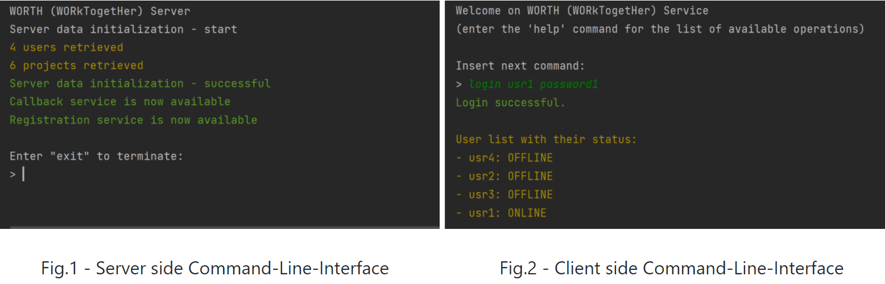

# LR_Project-WORTH
"Network Programming" Class Project - BSc in Computer Science @ University of Pisa

<!-- PROJECT LOGO -->
<br />
<p align="center">
  <a href="https://github.com/othneildrew/Best-README-Template">
    
  </a>

  <h3 align="center">WORTH - WORk TogetHer</h3>

  <p align="center">
    End of Course Project A.A. 2020/21
    <br />
    <a href="docs/Relazione_WORTH"><strong>Explore the docs (in Italian) »</strong></a>
    <br />
    <a href="Progetto_WORTH_IT">Request Feature (in Italian)</a>
  </p>
</p>


<!-- TABLE OF CONTENTS -->
<details open="open">
  <summary>Table of Contents</summary>
  <ol>
    <li>
      <a href="#about-the-project">About The Project</a>
      <ul>
        <li><a href="#built-with">Built With</a></li>
      </ul>
    </li>
    <li>
      <a href="#getting-started">Getting Started</a>
      <ul>
        <li><a href="#prerequisites">Prerequisites</a></li>
        <li><a href="#installation">Installation</a></li>
      </ul>
    </li>
    <li><a href="#usage">Usage</a></li>
    <li><a href="#contact">Contact</a></li>
    <li><a href="#acknowledgements">Acknowledgements</a></li>
  </ol>
</details>


<!-- ABOUT THE PROJECT -->
## About The Project

<p align = "center">

</p>
<p align = "center">

</p>
<p align = "center">
Fig.3 - Chat Interface
</p>
<br>

In recent years, numerous collaborative applications have been created for content sharing, messaging, videoconferencing, project management, etc. 
In this educational project, WORTH(WORkTogetHer), we will focus on organizing and managing projects in a collaborative way. 
The collaboration and project management applications (e.g. [Trello](https://trello.com/), [Asana](https://asana.com/)) help people get organized and coordinate in carrying out common projects.
These can be professional projects, or in general, any activity can be organized into a series of tasks (e.g. to-do list) which are carried out by members of a group:
the applications of interest are of different types, such as organizing a software development project with colleagues from the development team, but also organizing a party with a group of friends.    
    
Some of these tools (eg Trello) implement the Kanban method (sign or billboard, in Japanese), an “agile” management method. 
The Kanban board provides an overview of the activities and displays their evolution, for example from creation and subsequent progress to completion, after the review phase has been successfully passed.
A person in the working group may take charge of one activity when it has the possibility, moving the activity on the blackboard.    
    
The project consists in the implementation of WORkTogetHer (WORTH): a tool for managing collaborative projects inspired by some principles of the Kanban methodology.

### Built With

* [Java](https://www.java.com/)
* [JDK12](https://www.oracle.com/it/java/technologies/javase/jdk12-archive-downloads.html)
* [Jackson](https://github.com/FasterXML/jackson)


<!-- GETTING STARTED -->
## Getting Started

This is an example of how you may give instructions on setting up your project locally.
To get a local copy up and running follow these simple example steps.

### Prerequisites

You will need Java jdk 12 to compile 
  1. Windows 
     1. Use this [guide](https://docs.oracle.com/en/java/javase/12/install/installation-jdk-microsoft-windows-platforms.html#GUID-A7E27B90-A28D-4237-9383-A58B416071CA) by Oracle
  2. Linux 
     1. Use this [guide](https://docs.oracle.com/en/java/javase/12/install/installation-jdk-linux-platforms.html#GUID-737A84E4-2EFF-4D38-8E60-3E29D1B884B8) by Oracle
  3. MacOS
     1. Use this [guide](https://docs.oracle.com/en/java/javase/12/install/installation-jdk-macos.html#GUID-2FE451B0-9572-4E38-A1A5-568B77B146DE) by Oracle

### Installation

1. Clone the repo
   ```sh
   git clone https://github.com/PaulMagos/WORTH.git
   ```
2. Open directory
   ```sh
   cd LR_Project-WORTH
      ```
3. Compile
   1. Windows
     ```sh
     javac -d "bin" -cp lib/jackson-annotations-2.9.7.jar;lib/jackson-core-2.9.7.jar;lib/jackson-databind-2.9.7.jar;lib/jackson-datatype-jsr310-2.9.7.jar @paths.txt
     ```
4. Run Server
   1. Windows
     ```sh
     java -cp lib/jackson-annotations-2.9.7.jar;lib/jackson-core-2.9.7.jar;lib/jackson-databind-2.9.7.jar;lib/jackson-datatype-jsr310-2.9.7.jar;bin com.ServerMain
     ```
5. Run Client
   1. Windows 
     ```sh
     java -cp  lib/jackson-annotations-2.9.7.jar;lib/jackson-core-2.9.7.jar;lib/jackson-databind-2.9.7.jar;lib/jackson-datatype-jsr310-2.9.7.jar;bin com.ClientMain
     ```

<!-- USAGE EXAMPLES -->
## Usage

The following is the diagram of an example of interaction between client and server illustrated in UML:

<p align = "center">

</p>


<!-- CONTACT -->
## Contact
[![LinkedIn][linkedin-shield]](https://www.linkedin.com/in/davide-chen-89aa02145/)


<!-- ACKNOWLEDGEMENTS -->
## Acknowledgements
* [JetBrains](https://www.jetbrains.com/)
* [Jackson](https://github.com/FasterXML/jackson)


<!-- MARKDOWN LINKS & IMAGES -->
<!-- https://www.markdownguide.org/basic-syntax/#reference-style-links -->
[contributors-shield]: https://img.shields.io/github/contributors/othneildrew/Best-README-Template.svg?style=for-the-badge
[contributors-url]: https://github.com/othneildrew/Best-README-Template/graphs/contributors
[forks-shield]: https://img.shields.io/github/forks/othneildrew/Best-README-Template.svg?style=for-the-badge
[forks-url]: https://github.com/othneildrew/Best-README-Template/network/members
[stars-shield]: https://img.shields.io/github/stars/othneildrew/Best-README-Template.svg?style=for-the-badge
[stars-url]: https://github.com/othneildrew/Best-README-Template/stargazers
[issues-shield]: https://img.shields.io/github/issues/othneildrew/Best-README-Template.svg?style=for-the-badge
[issues-url]: https://github.com/othneildrew/Best-README-Template/issues
[license-shield]: https://img.shields.io/github/license/othneildrew/Best-README-Template.svg?style=for-the-badge
[license-url]: https://github.com/othneildrew/Best-README-Template/blob/master/LICENSE.txt
[linkedin-shield]: https://img.shields.io/badge/-LinkedIn-black.svg?style=for-the-badge&logo=linkedin&colorB=555
[linkedin-url]: https://linkedin.com/in/othneildrew
[product-screenshot]: images/screenshot.png
